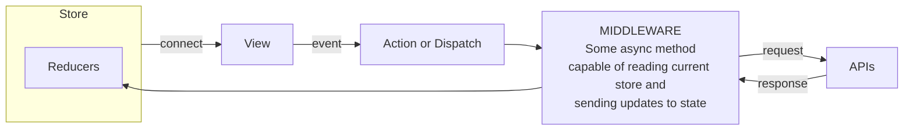
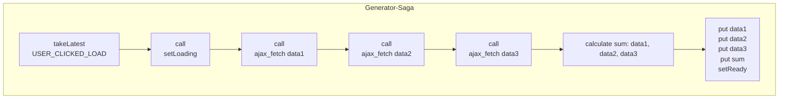

# Sissejuhatus redux-saga kasutamisse

## Üldine React-redux rakenduse skeem



## STORE:

Kogu rakenduse ülene javascripti objekt, mis peaks kajastama kogu rakenduse hetke andmeid / sruktuuri jne. Kõik muudatused `store`le peavad olema immutable ehk `old_prop !== new_prop` ja `old_store !== new_store`.

## View:

Reactis vaadet renderdav klass või meetod, mis üldjuhul seob ennast mõnede stores leiduvate väärtuste külge kasutades `connect()` meetodit või saab propsid otse parameetritena sisse. Ideaalis peaks stores sisalduv 1:1 kirjeldama ära kogu vaate. Praktikas on vahest mõistlik kasutada sisemist `state` objekti lisaks, aga pigem hoiduda kui saab. View (React.PureComponent) teab ennast renderdada kui mõni proppidest vastab tingimusele `old !== new`.

## Action or Dispatch:

Kui kasutaja teeb Viewl mingi eventi, nagu klikib või sisestab tähe, siis selle tulemusel kutsub View välja olenevalt middleware valikust:

* Redux thunk - Action meetodi (mille sees omakorda asynk thunk meetod)
* Redux-saga - Dispatch meetodi, mis ei pea `store` muudatust otse välja kutsuma vaid võib ka olla lihtsalt teavitus eventiks sagadele, et kasutaja tegi midagi.

## MIDDLEWARE:

### Redux-thunk

Hetkel on meil kasutusel Redux thunk, mis pakib Action meetodi ümber omakorda meetodi väljakutsumise, millele antakse kaasa parameetritena meetodid:

* `getState()` - tagastab hetkel kehtiva store
* `dispatch()` - võimaldab välja kutsuda store muutmise meetodeid (reducer)

View:
```javascript
class MyView extends PureComponent {
  handleClick = () => {
    const { userId, fetchUser } = this.props;
    fetchUser(userid);
  }

  render() {
    <button onClick={ this.handleClick }>
      Fetch user info
    </button>
  }
}
const mapDispatchToProps = dispatch => bindActionCreators({ fetchUser }, dispatch);
export default connect(undefined, mapDispatchToProps)(MyView);
```

Action-thunk:
```javascript
function fetchUser(id) {

  // The async capable method
  // capable of reading current store
  // and sending updates to state
  return async (dispatch, getState) => {

    // Reading current store
    const state = getsSate();

    if (state.user.id !== id) {

      // Communicating with api asynchronously
      try {
        const user = await ajax('GET', `/user/${ id }`):
      } catch() {
        // calling reducer to update state to notify error
        dispatch({ type: 'SET_USER_FETCH_ERROR', userId: id });
      }

      // calling reducer to update state
      dispatch({ type: 'SET_USER', user });

    }
  }
}
```
### Redux-saga

Redux-Saga loogika järgi kasutaja event tagajärjel kutsutakse välja `dispatch()` meetod. See on justkui globaalne event 
rakenduse storel, mis teavitab, et midagi juhtus/tehti.
Saga võimekus kõikki store evente kuulata ja selle tagakärjel käivitauda.


View:
```javascript
class MyView extends PureComponent {
  handleClick = () => {
    const { userId, dispatch } = this.props;
    dispatch({
      type: 'USER_CLICKED_FETCH_INFO',
      userId: userId
    });
  }

  render() {
    <button onClick={ this.handleClick }>
      Fetch user info
    </button>
  }
}
const mapDispatchToProps = dispatch => ({ dispatch });
export default connect(undefined, mapDispatchToProps)(MyView);
```

```javascript

function* fetchUserInfo(action) {
  const { userId } = action;

  // Reading reading current store state
  const currentState = yield select();

  if (state.user.id !== userId) {

    // Communicating with api asynchronously
    try {
      const user = yield ajax('GET', `/user/${ userId }`);
    } catch() {
      // calling reducer to update state to notify error
      yield put({ type: 'SET_USER_FETCH_ERROR', userId: userId });
    }

    // calling reducer to update state
    yield put({ type: 'SET_USER', user });
  }
}

function* userSaga() {
  yield all([
    takeLatest([ 'USER_CLICKED_FETCH_INFO' ], fetchUserInfo),
  ]);
}

export default initializeApp;
```

Üldpildis on saga meetod sisult samasugune kui thunk asünk meetod aga selliste asendustega:

* `dispatch()` -> `yield put()`
* `getState()` -> `yeild select()`
* `await` -> `yield`

# Küsimus: miks kolida saga-generaator funktsioonidele?

Kui pea ainuke vahe tundub olema asynk funktsiooni asendamine saga wrapitud generaator funktsiooniga, siis miks? Mis kasu see toob?
Probleem seisneb selles, et asynk funktsioonil pole mingit sisemist võimekust ennast peatada kui ta käima on lastud.
Ehk kui süütad, siis põleb lõpuni.

Redux-Saga kasutab js generaator funktsioone, et sisuliselt taasluua
asynk funktsioonide funktsionaalsus aga koos võimekusega:

* Katkestada koodi käivitumine asünkroonsete ettappide vahel
* Propageerida see katkestamine ka sisemistele generaator funktsioonidele
* Anda võimekus igale generaator funktsioonile teha koristustöid juhul kui ta katsekstatakse

Lisaks Pakub Redux saga:

* Mitmes kohas sama sündmuse peale millegi tegemise (parem eristatus koodi osade vahel - iga kood saab paremine vastutada ainult enda eest)
* Meetodid protsesside jälgimiseks ja katkestamiseks (eventide race, viimane jääb peale, mõne muu protsessi algus katkestab käimasoleva, jne)

Kahjuks sellega tuleb kaasa ka tavaline event based süsteemide puudus,
et on keerulisem jälgida kas eventi peale keegi midagi ka tegi ja ka taguspidi, et kes selle eventi saatis.
Siin aitab ainult ühtne kokkulepitud struktuur, koodi puhtus ja *common sense*. Esimene neist kusjuures kõige olulisem.

Lisaks on üpris lihtne kasutada asynk meetodied saga generaatori sees, asenda  `await` -> `yield`. Tagurpidi aga 
on vaja mingi kaval wrapper ehitada ja keerulisem märgatavalt.

## Lühidalt `function*`

Sisuliselt selline spetsiaalne funktsioon, mis iga kord next() küsides tagastab järgmise talle antud yield väärtuse.

```javascript
function* anotherGenerator(i) {
  yield i + 1;
  yield i + 2;
  yield i + 3;
}

function* generator(i) {
  yield i;
  yield* anotherGenerator(i);
  yield i + 10;

  return "END";
}

var gen = generator(10);

console.log(gen.next().value); // 10
console.log(gen.next().value); // 11
console.log(gen.next().value); // 12
console.log(gen.next().value); // 13

console.log(gen.next()); // { value: 20, done: false }
console.log(gen.next()); // { value: "END", done: true }
console.log(gen.next()); // { value: undefined, done: true }

```

Ehk justkui ei midagi maagilist ja pea kogu võimekkus, millest enne oli jutt, tuleneb saga meetoditest mis pannakse
nende generaator funktsioonide ümber.

# Saga efektid/meetodid

Lihtsustatud kirjeldus on et Sagade seos Middlewarena ja ka effektid sisuliselt kutsuvad koguaeg välja next() kuni 
pole öeldud et on katkestatud.

* `select()` - tagastab küsimise hetkel kogu store state.
* `put({ type: 'EVENT', data: data })` - kutsub välja redux `dispatch()` meetodi
* `take('EVENT')` - ootab kuni juhtub event
* `call(generaatorF)` - kutsu välja teine generaator
* `all[generatorF, generatorF, generatorF, ...]` - jooksuta saagasid (generaatorid) paralleelselt. 
  * Protsessid jooksevad paralleelselt, aga jäävad väljakutsuva generaatoriga seotuks. Ehk kui parent generaatorile
    kutsutakse välja katkestus, siis samal hetkel saavad ka kõik alamgeneraatorid ja nende alamgeneraatorid katkestatud.
  * Sagades on sama meetodi analoog meetod `fork(generaatorF)` - Spekis mõiste: *attached fork*
* `spawn(generatorF)` - kutsu välja teine generaaator, aga ära oota tulemust ja kui parent katkestatakse, siis kutsutud
  meetodit ei katkestata automaatselt. Spekis mõiste: *detached fork*
* `takeEvery('EVENT', generatorF)`- iga kord kui kutsutakse 'EVENT' pannaks käima generatorF, mitu saab korraga joosta.
* `takeLatest('EVENT', generatorF)`- iga kord kui kutsutakse 'EVENT' pannaks käima generatorF aga eelmised,
   mis käima pandud, katkestatakse. Üks saab korraga koosta.
* `yield race({ [ key: string ]: saga })` - defineerib mitu sagat omavahel race konditsiooniga, et ühe käivitus katkestab teised

   ```javascript
    takeEvery([
      'SET_ACTIVE_TAB'
    ], function* (action) {
      yield race({
        task: call(loadChartsOnTabLoad, action),
        cancel1: take('TOKEN_CURRENT_FILTER_CHANGE_STARTED'),
        cancel2: take('TOKEN_BASE_FILTER_CHANGE_STARTED'),
      });
    }),
   ```

# Hea tava arhitektuur

1. Eventid, mida kasutaja tegi, suunata alati läbi saga, anda selgelt prefixiga eristuv nimi ja mitte siduda otse
  reduceriga et muuta storet. Näiteks : `'USER_CLICKED_BUTON'`. See on selleks, et teada kust poolt event tuli,
  kas süsteemist või kasutaja intent. See teeb tihti järgmisele arendajal elu lihtsamaks, kes sama meetodit edasi
  keerulisemaks arendab.

2. Ära dispatchi poolikuid state vaid kogu kokku kogu info mis vaja täis muudatuse tegemiseks ja siis tee lõpus üks
  suur `batch()` mille sees on kõik muudatuste dispatchid. Sellisena ei pea sa muretsema kuidas rollbackida state seisu
  kui saga generaator katkestatakse. Samuti vähendad rendereid ja poolikutest statedest tekkivaid vigu ja iffide rägastikku.

Flow näide

