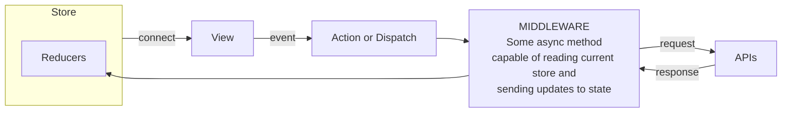

# Sissejuhatus redux-saga kasutamisse

## Üldine React-redux rakenduse skeem



## STORE:

Kogu rakenduse ülene javascripti objekt, mis peaks kajastama kogu rakenduse hetke andmeid / sruktuuri jne. Kõik muudatused `store`le peavad olema immutable ehk `old_prop !== new_prop` ja `old_store !== new_store`.

## View:

Reactis vaadet renderdav klass või meetod, mis üldjuhul seob ennast mõnede stores leiduvate väärtuste külge kasutades `connect()` meetodit või saab propsid otse parameetritena sisse. Ideaalis peaks stores sisalduv 1:1 kirjeldama ära kogu vaate. Praktikas on vahest mõistlik kasutada sisemist `state` objekti lisaks, aga pigem hoiduda kui saab. View (React.PureComponent) teab ennast renderdada kui mõni proppidest vastab tingimusele `old !== new`.

## Action or Dispatch:

Kui kasutaja teeb Viewl mingi eventi, nagu klikib või sisestab tähe, siis selle tulemusel kutsub View välja olenevalt middleware valikust:

* Redux thunk - Action meetodi (mille sees omakorda asynk thunk meetod)
* Redux-saga - Dispatch meetodi, mis ei pea `store` muudatust otse välja kutsuma vaid võib ka olla lihtsalt teavitus eventiks sagadele, et kasutaja tegi midagi.

## MIDDLEWARE:

### Redux-thunk

Hetkel on meil kasutusel Redux thunk, mis pakib Action meetodi ümber omakorda meetodi väljakutsumise, millele antakse kaasa parameetritena meetodid:

* `getState()` - tagastab hetkel kehtiva store
* `dispatch()` - võimaldab välja kutsuda store muutmise meetodeid (reducer)

```javascript
function fetchUser(id) {

  // The async capable method
  // capable of reading current store
  // and sending updates to state
  return async (dispatch, getState) => {
    
    // Reading current store
    const state = getsSate();
    
    if (state.user.id !== id) {

      // Communicating with api asynchronously
      const user = await ajax('GET', `/user/${ id }`):
      
      // calling reducer to update state
      dispatch({ type: 'SET_USER', user }):

    }
  }
}
```

